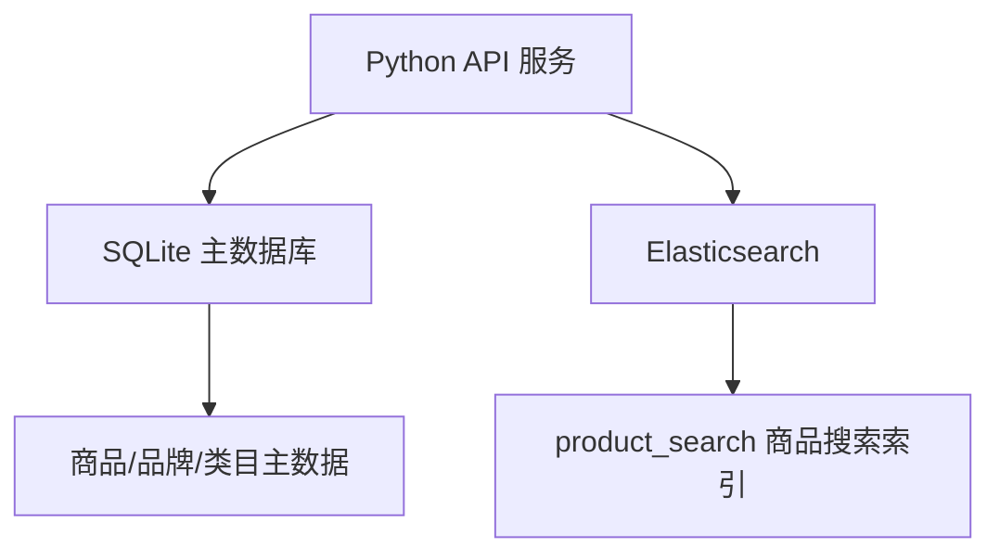
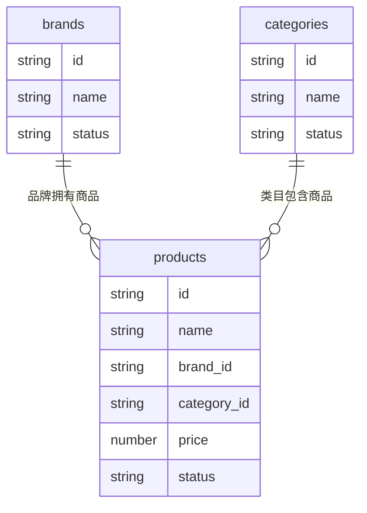
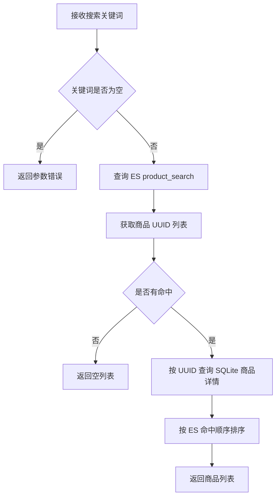
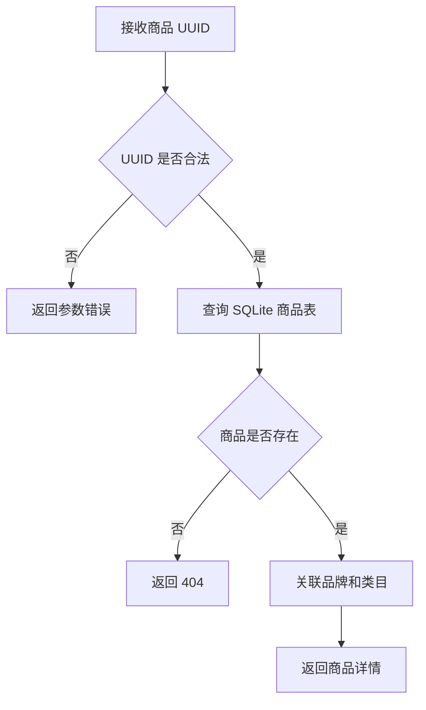
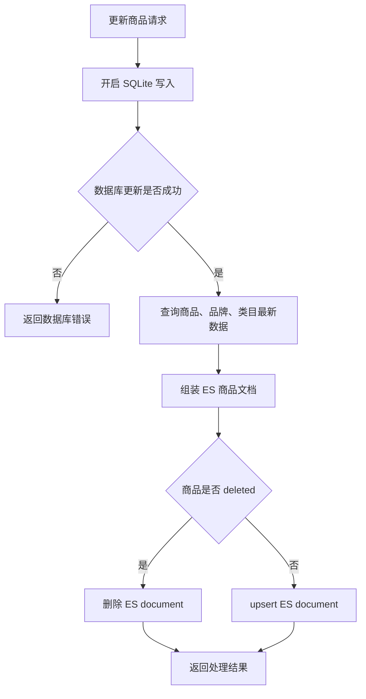
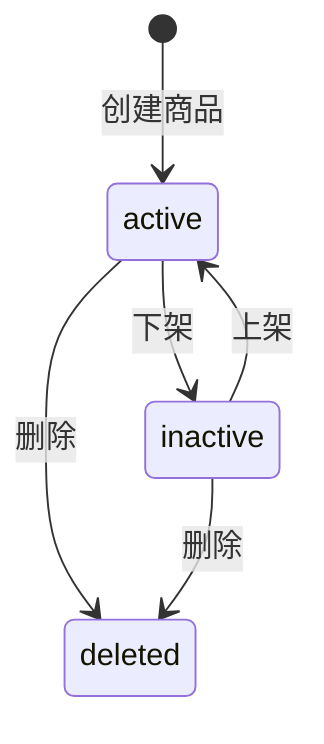

# ES 商品搜索项目开发文档

## 1. 方案概述

本项目实现一个基于 SQLite + Elasticsearch 的简单商品搜索能力。SQLite 保存真实业务数据，Elasticsearch 保存面向搜索的商品索引副本。用户搜索时先查询 ES 获取商品 UUID 列表，再根据 UUID 回查 SQLite 返回商品详情。

本期目标只做简单商品搜索，不做 AI 知识库问答、不做向量检索、不做复杂后台管理。

核心目标：

1. 支持商品、品牌、类目三类信息的组合搜索。
2. 搜索结果返回真实商品数据，而不是只返回 ES 文档。
3. 商品、品牌、类目数据更新成功后，立即同步刷新 ES 商品索引。
4. 全部业务 ID 使用 UUID，不使用自增 ID。

## 2. 业务架构

商品搜索链路围绕“数据库主数据 + ES 搜索副本”展开。数据库负责准确性，ES 负责搜索召回和相关性排序。


### 2.1 核心业务对象

| 对象 | 说明 |
|---|---|
| 商品 | 搜索和详情展示的主体，使用 UUID 作为主键 |
| 品牌 | 商品所属品牌，搜索时作为商品索引的冗余字段 |
| 类目 | 商品所属类目，搜索时作为商品索引的冗余字段 |
| ES 商品索引 | 每个商品对应一个 ES document，document ID 使用商品 UUID |

### 2.2 本期不做的能力

| 能力 | 本期处理方式 |
|---|---|
| 向量检索 | 暂不实现，先使用 ES 普通文本检索 |
| AI 问答 | 暂不实现 |
| 多租户 | 暂不实现 |
| 权限过滤 | 暂不实现 |
| 异步消息队列 | 暂不引入，DB 更新成功后同步刷新 ES |
| 复杂后台管理 | 只规划必要的数据写入与同步规则 |

## 3. 接口规划

本期对外核心接口只需要两个：商品搜索接口、商品详情接口。数据维护接口可以根据开发方式决定是否开放；如果只是本地学习项目，也可以先通过脚本或内部方法写入 SQLite 后同步 ES。

### 3.1 商品搜索接口

```text
GET /api/products/search?q={keyword}&page={page}&size={size}
```

用途：用户随机输入商品名、品牌名、类目名或它们的组合，系统通过 ES 检索匹配商品，再回查 SQLite 返回商品列表。

请求参数：

| 参数 | 必填 | 说明 |
|---|---|---|
| `q` | 是 | 搜索关键词，可输入商品、品牌、类目 |
| `page` | 否 | 页码，默认 1 |
| `size` | 否 | 每页数量，默认 10 |

处理流程：

1. 校验 `q` 不能为空。
2. 使用 `q` 查询 ES `product_search` 索引。
3. ES 返回按相关性排序的 `product_id` UUID 列表。
4. 使用 UUID 列表查询 SQLite 商品、品牌、类目信息。
5. 按 ES 返回顺序组装商品列表。
6. 返回搜索结果。

响应字段建议：

| 字段 | 说明 |
|---|---|
| `items` | 商品列表 |
| `items[].id` | 商品 UUID |
| `items[].name` | 商品名称 |
| `items[].brand.id` | 品牌 UUID |
| `items[].brand.name` | 品牌名称 |
| `items[].category.id` | 类目 UUID |
| `items[].category.name` | 类目名称 |
| `items[].price` | 商品价格 |
| `items[].status` | 商品状态 |
| `total` | ES 命中的总数量 |
| `page` | 当前页码 |
| `size` | 每页数量 |

### 3.2 商品详情接口

```text
GET /api/products/{product_id}
```

用途：根据商品 UUID 查询商品详情。该接口直接查询 SQLite，不查询 ES。

路径参数：

| 参数 | 必填 | 说明 |
|---|---|---|
| `product_id` | 是 | 商品 UUID |

处理流程：

1. 校验 `product_id` 是合法 UUID。
2. 查询 SQLite 商品表。
3. 关联查询品牌和类目。
4. 商品不存在或已删除时返回 404。
5. 返回商品详情。

响应字段建议：

| 字段 | 说明 |
|---|---|
| `id` | 商品 UUID |
| `name` | 商品名称 |
| `description` | 商品描述 |
| `price` | 商品价格 |
| `brand` | 品牌信息 |
| `category` | 类目信息 |
| `status` | 商品状态 |
| `created_at` | 创建时间 |
| `updated_at` | 更新时间 |

### 3.3 数据维护接口

如果本项目后续需要通过接口维护数据，可以补充以下接口。它们不是搜索功能的必需接口，但会触发 ES 同步。

| 接口 | 说明 | ES 同步行为 |
|---|---|---|
| `POST /api/products` | 创建商品 | 新增 ES 商品文档 |
| `PUT /api/products/{product_id}` | 更新商品 | 覆盖 ES 商品文档 |
| `DELETE /api/products/{product_id}` | 删除商品 | 删除或标记 ES 商品文档 |
| `PUT /api/brands/{brand_id}` | 更新品牌 | 刷新该品牌下所有商品的 ES 文档 |
| `PUT /api/categories/{category_id}` | 更新类目 | 刷新该类目下所有商品的 ES 文档 |

## 4. 技术架构

系统由三部分组成：SQLite 业务数据层、ES 搜索索引层、Python 接口服务层。



### 4.1 SQLite 职责

SQLite 是主数据源，保存商品、品牌、类目的真实数据。接口返回商品详情时以 SQLite 为准。

### 4.2 Elasticsearch 职责

ES 是搜索索引，只保存商品搜索所需的冗余字段，包括商品名、品牌名、类目名和组合搜索字段。ES document ID 直接使用商品 UUID。

### 4.3 Python 服务职责

Python 负责：

1. 提供商品搜索接口。
2. 提供商品详情接口。
3. 在商品、品牌、类目更新后组装 ES 文档。
4. 执行 ES upsert 或 delete。
5. 保证搜索结果回查 SQLite 后再返回。

## 5. 数据架构

本期数据库只保留三张主表：商品表、品牌表、类目表。所有主键统一使用 UUID 字符串。



### 5.1 品牌表

```sql
CREATE TABLE brands (
    id TEXT PRIMARY KEY,              -- 品牌 UUID
    name TEXT NOT NULL,               -- 品牌名称
    description TEXT,                 -- 品牌描述
    status TEXT NOT NULL,             -- 状态：active=启用，inactive=停用，deleted=已删除
    created_at TEXT NOT NULL,         -- 创建时间
    updated_at TEXT NOT NULL          -- 更新时间
);
```

### 5.2 类目表

```sql
CREATE TABLE categories (
    id TEXT PRIMARY KEY,              -- 类目 UUID
    name TEXT NOT NULL,               -- 类目名称
    parent_id TEXT,                   -- 父级类目 UUID，本期可以为空
    status TEXT NOT NULL,             -- 状态：active=启用，inactive=停用，deleted=已删除
    created_at TEXT NOT NULL,         -- 创建时间
    updated_at TEXT NOT NULL          -- 更新时间
);
```

### 5.3 商品表

```sql
CREATE TABLE products (
    id TEXT PRIMARY KEY,              -- 商品 UUID
    name TEXT NOT NULL,               -- 商品名称
    description TEXT,                 -- 商品描述
    price REAL,                       -- 商品价格
    brand_id TEXT NOT NULL,           -- 品牌 UUID
    category_id TEXT NOT NULL,        -- 类目 UUID
    status TEXT NOT NULL,             -- 状态：active=上架，inactive=下架，deleted=已删除
    created_at TEXT NOT NULL,         -- 创建时间
    updated_at TEXT NOT NULL,         -- 更新时间
    FOREIGN KEY (brand_id) REFERENCES brands(id),
    FOREIGN KEY (category_id) REFERENCES categories(id)
);
```

### 5.4 必要索引

```sql
CREATE INDEX idx_products_brand_id ON products(brand_id);
CREATE INDEX idx_products_category_id ON products(category_id);
CREATE INDEX idx_products_status ON products(status);
CREATE INDEX idx_brands_status ON brands(status);
CREATE INDEX idx_categories_status ON categories(status);
```

## 6. ES 索引配置

本期只需要一个 ES 索引：

```text
product_search
```

每个商品一条 ES document，document ID 使用 `products.id`。

### 6.1 ES 文档结构

```json
{
  "product_id": "商品 UUID",
  "product_name": "商品名称",
  "brand_id": "品牌 UUID",
  "brand_name": "品牌名称",
  "category_id": "类目 UUID",
  "category_name": "类目名称",
  "search_text": "商品名称 品牌名称 类目名称",
  "status": "active",
  "updated_at": "2026-05-25T15:00:00"
}
```

### 6.2 字段类型建议

| 字段 | 类型 | 说明 |
|---|---|---|
| `product_id` | `keyword` | 商品 UUID |
| `product_name` | `text` + `keyword` | 商品名，支持搜索和精确匹配 |
| `brand_id` | `keyword` | 品牌 UUID |
| `brand_name` | `text` + `keyword` | 品牌名，支持搜索和精确匹配 |
| `category_id` | `keyword` | 类目 UUID |
| `category_name` | `text` + `keyword` | 类目名，支持搜索和精确匹配 |
| `search_text` | `text` | 组合搜索字段 |
| `status` | `keyword` | 商品状态 |
| `updated_at` | `date` | 更新时间 |

### 6.3 搜索权重建议

商品搜索时优先匹配商品名，再匹配品牌和类目。

| 字段 | 权重 |
|---|---|
| `product_name` | 3 |
| `brand_name` | 2 |
| `category_name` | 2 |
| `search_text` | 1 |

搜索时固定过滤：

```text
status = active
```

## 7. 核心流程

### 7.1 商品搜索流程

搜索流程体现 ES 和 SQLite 的职责分工：ES 负责找 ID，SQLite 负责返回真实数据。



步骤说明：

1. 接收 `q`、`page`、`size` 参数。
2. 校验 `q` 不能为空。
3. 查询 ES，匹配商品名、品牌名、类目名和组合字段。
4. ES 返回商品 UUID 和相关性分数。
5. SQLite 根据 UUID 查询商品详情。
6. 过滤数据库中已删除或不可见的商品。
7. 按 ES 相关性顺序返回。

### 7.2 商品详情流程

商品详情以数据库为准，不依赖 ES。



### 7.3 商品更新后同步 ES

商品更新后需要立即重建该商品的 ES 搜索文档。



同步规则：

| 数据变化 | ES 处理 |
|---|---|
| 新增商品 | 新增 ES document |
| 修改商品名称、描述、价格、状态 | 覆盖当前商品 ES document |
| 删除商品 | 删除 ES document，或将 `status` 更新为 `deleted` |
| 修改品牌名称 | 刷新该品牌下所有商品 ES document |
| 修改类目名称 | 刷新该类目下所有商品 ES document |

## 8. 状态设计

状态只保留搜索需要的最小集合。

### 8.1 商品状态

| 状态 | 中文说明 | 是否进入搜索 |
|---|---|---|
| `active` | 上架 | 是 |
| `inactive` | 下架 | 否 |
| `deleted` | 已删除 | 否 |



### 8.2 品牌和类目状态

| 状态 | 中文说明 |
|---|---|
| `active` | 启用 |
| `inactive` | 停用 |
| `deleted` | 已删除 |

品牌或类目停用后，是否影响商品搜索需要按业务决定。本期建议：商品自身为 `active` 时仍可搜索，品牌和类目只作为展示字段。

## 9. 配置规划

项目需要提供数据库、ES、搜索分页和同步行为相关配置。

### 9.1 SQLite 配置

| 配置名 | 示例值 | 说明 |
|---|---|---|
| `SQLITE_DB_PATH` | `./data/simplees.db` | SQLite 数据库文件路径 |
| `SQLITE_ECHO_SQL` | `false` | 是否打印 SQL 日志 |

### 9.2 Elasticsearch 配置

| 配置名 | 示例值 | 说明 |
|---|---|---|
| `ES_HOST` | `http://127.0.0.1:9200` | ES 地址 |
| `ES_USERNAME` | 空 | ES 用户名，本地无鉴权可为空 |
| `ES_PASSWORD` | 空 | ES 密码，本地无鉴权可为空 |
| `ES_PRODUCT_INDEX` | `product_search` | 商品搜索索引名 |
| `ES_REQUEST_TIMEOUT_SECONDS` | `5` | ES 请求超时时间 |

### 9.3 搜索配置

| 配置名 | 示例值 | 说明 |
|---|---|---|
| `SEARCH_DEFAULT_PAGE_SIZE` | `10` | 默认每页数量 |
| `SEARCH_MAX_PAGE_SIZE` | `50` | 最大每页数量 |
| `SEARCH_MIN_KEYWORD_LENGTH` | `1` | 最短搜索关键词长度 |

### 9.4 同步配置

| 配置名 | 示例值 | 说明 |
|---|---|---|
| `ES_SYNC_AFTER_DB_COMMIT` | `true` | DB 更新成功后是否立即同步 ES |
| `ES_SYNC_FAIL_STRATEGY` | `return_error` | ES 同步失败时是否返回错误 |

本期建议 `ES_SYNC_FAIL_STRATEGY=return_error`。原因是项目简单，先暴露同步失败问题，避免数据库和 ES 长时间不一致。

## 10. 异常处理

异常处理重点关注参数错误、数据库无数据、ES 不可用和 DB/ES 不一致。

| 场景 | 处理方式 |
|---|---|
| 搜索关键词为空 | 返回参数错误 |
| 商品 UUID 非法 | 返回参数错误 |
| 商品不存在 | 返回 404 |
| ES 查询失败 | 搜索接口返回服务错误 |
| DB 查询失败 | 返回服务错误 |
| DB 更新成功但 ES 同步失败 | 返回服务错误并记录日志 |
| ES 命中商品但 DB 已删除 | 过滤该商品，不返回 |

## 11. 开发顺序建议

建议按以下顺序开发，避免一开始就陷入同步细节。

1. 建 SQLite 三张表并准备测试数据。
2. 创建 ES `product_search` 索引。
3. 实现商品数据写入 ES 的初始化脚本或内部方法。
4. 实现商品搜索接口。
5. 实现商品详情接口。
6. 实现商品更新后刷新 ES。
7. 实现品牌、类目更新后批量刷新关联商品 ES 文档。
8. 补充异常日志和基础测试。

## 12. 验收标准

本期功能完成后，应满足以下标准：

1. 商品、品牌、类目均使用 UUID，不出现自增 ID。
2. 用户输入商品名可以搜索到商品。
3. 用户输入品牌名可以搜索到该品牌下商品。
4. 用户输入类目名可以搜索到该类目下商品。
5. 搜索接口先查 ES，再按 ID 查 SQLite。
6. 商品详情接口只查 SQLite。
7. 商品名称更新后，ES 搜索结果立即变化。
8. 品牌名称更新后，该品牌下商品的 ES 搜索结果立即变化。
9. 类目名称更新后，该类目下商品的 ES 搜索结果立即变化。
10. ES 不可用时，搜索接口能返回明确错误。
